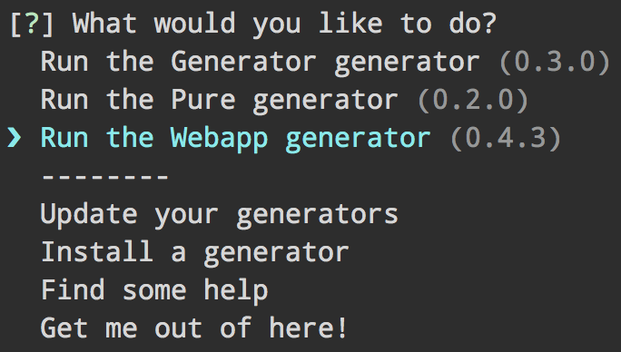

# Yo [](https://travis-ci.org/yeoman/yo) [](https://www.youtube.com/watch?v=9auOCbH5Ns4)




## What's Yeoman?

Yeoman helps you to kickstart new projects, prescribing best practices and tools to help you stay productive.

To do so, we provide a [generator ecosystem](http://yeoman.io/generators/). A generator is basically a plugin that can be run with the `yo` command to scaffold complete projects or useful parts.

## Usage

```bash
# First install a generator
npm -g install generator-webapp

# Then run it
yo webapp
```

To find a generator, visit http://yeoman.io/generators/

To create and distribute your own generator, refer to [our official documentation](http://yeoman.io/authoring/)

## Options

- `--no-color` Disable colors.
- `--version` Print the current `yo` version.
- `--help` Print `yo` help menu with the list of found generators.
- `--[no-]insight` to toggle anonymous [Insight](https://github.com/yeoman/insight) tracking which helps us improve Yeoman. Using either of these flags on the first run will prevent you from being prompted about it interactively. The flags can also be used to change it later on.
- `--generators` Print available generators.


## Troubleshooting

Running `yo doctor` command can help you troubleshoot most common issues.

If `doctor` doesn't help, then check opened issues for a similar problem. Open a new issue if your problem haven't been reported yet. Make sure to always include the version of `yo` (`yo --version`) and Node.js (`node --version`) you use.

If your issue only occurs using a generator, please report the issues on the generator's repository.


## Contribute

See the [contributing docs](http://yeoman.io/contributing/).


## Changelog

See the [release page](https://github.com/yeoman/yo/releases).


## License

BSD-2-Clause © Google
